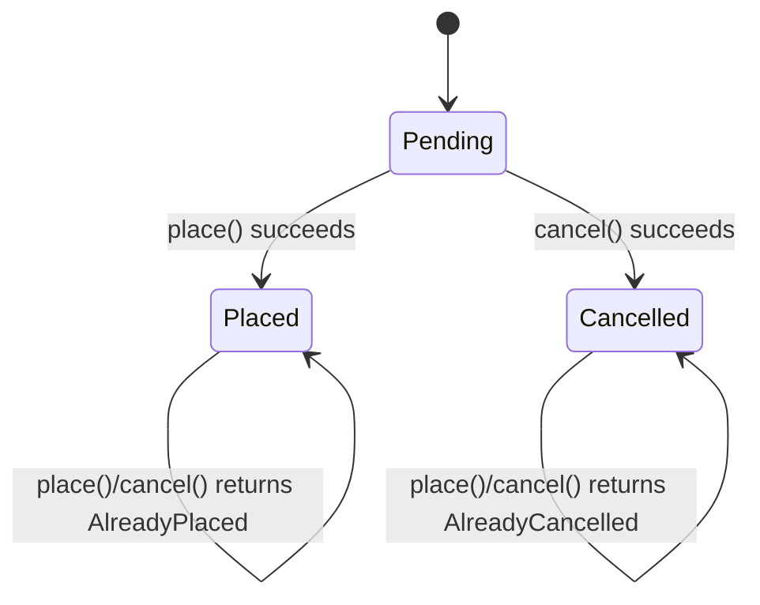

# Model an agent as a state machine

**Goal:** give an agent a lifecycle — `Pending → Placed`, `Open → Closed` — where
the current state is a sum, the start state is explicit, and transitions are
checked.

## Make the state a sum with an initial variant

A state field can be a sum type as long as it declares its **initial state** with
an initialiser:

```karn
context orders

type OrderStatus = enum { Pending, Placed, Cancelled }
type OrderError  = enum { AlreadyPlaced, AlreadyCancelled }

agent Order {
  key id: String

  state {
    status: OrderStatus = Pending,   -- the state machine; starts Pending
    items:  Int,                      -- extended state; implicit zero 0
  }

  on call place() -> Effect[Result[(), OrderError]] {
    match self.state.status {
      Pending => {
        commit { ...self.state, status: Placed }
        Ok(())
      }
      Placed    => Err(AlreadyPlaced)
      Cancelled => Err(AlreadyCancelled)
    }
  }

  on call cancel() -> Effect[Result[(), OrderError]] {
    match self.state.status {
      Pending => {
        commit { ...self.state, status: Cancelled }
        Ok(())
      }
      Placed    => Err(AlreadyPlaced)
      Cancelled => Err(AlreadyCancelled)
    }
  }
}
```

A fresh `Order` key starts at `Pending` — not `None`. The sum *is* the state, so
there is no separate "uninitialised" case to handle.



*The sum-typed `status` is the machine; each handler only advances from
`Pending`, and the exhaustive `match` makes the compiler check every case.*

Text equivalent: a fresh `Order` starts at `Pending`. `place()` advances
`Pending → Placed` and `cancel()` advances `Pending → Cancelled`, each returning
`Ok`; from any other state both return an error (`AlreadyPlaced` from `Placed`,
`AlreadyCancelled` from `Cancelled`), leaving the state unchanged. `Placed` and
`Cancelled` are terminal — no handler leaves them.

## Read the state, then transition

- **Read** the current state by matching on it: `match self.state.status { … }`.
  The match is exhaustive, so adding a state forces every handler to consider it.
- **Transition** by committing a new state: `commit { ...self.state, status:
  Placed }` keeps the other fields and moves `status`.
- **Guard** a transition by handling the wrong states explicitly — above, `place`
  succeeds only from `Pending` and returns an error otherwise.

## Initial values for any field

The same `= value` initialiser gives any field a starting value — a non-zero
default or a refined type that has no implicit zero:

```karn
type Level = Int where Positive

agent Gauge {
  key id: String
  state {
    level:   Level = 1,   -- refined; 0 would violate Positive
    retries: Int   = 3,   -- a non-zero default
  }

  on call peek() -> Effect[Result[(), String]] {
    Ok(())
  }
}
```

An initialiser must be a compile-time value (a literal, variant, record, or
`T.unsafe(lit)`); it can't reference `self`, parameters, or capabilities.

## Related

- Reference: [Agents](../../reference/agents.md) — state initialisation and the
  full state-machine rules.
- Tutorial: [Add a stateful agent](../../tutorials/05-stateful-agent.md).
