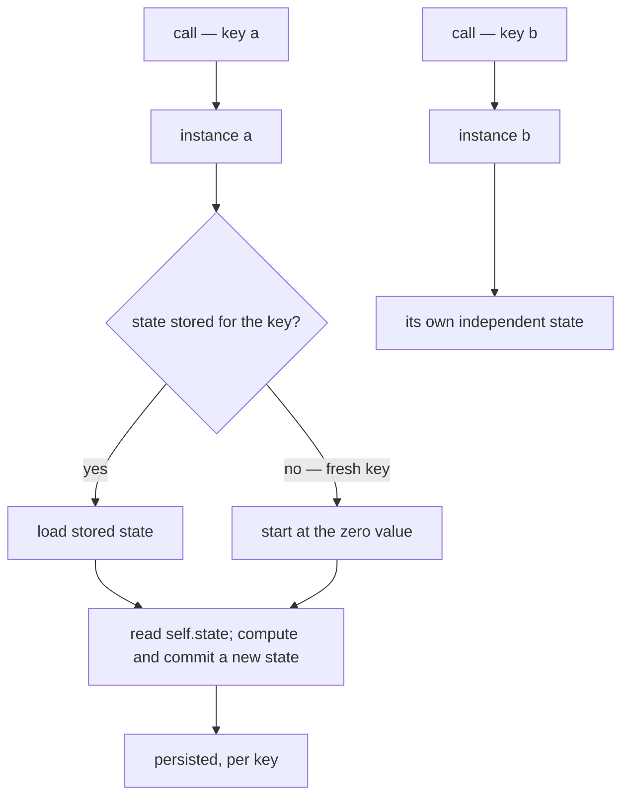

# The agent model

An **agent** is Karn's unit of state. It is a named thing, identified by a key,
that owns some state and exposes handlers to read and change it. This page
explains what that means and why agent state must be
*[zeroable](../../reference/glossary.md#term-zeroable)*.

## What an agent is

Most of a Karn program is stateless: functions and
[services](../../reference/glossary.md#term-service) transform inputs into outputs. An agent is the deliberate exception — the place where something is
*remembered* between calls.

Each agent has a **key**. Two calls naming the same key address the same logical
instance with the same state; different keys are independent. A `Counter` keyed by
`CounterId` is really a whole family of counters, one per id, each with its own
`count`. This maps directly onto the runtime: on the `workers` target an agent
becomes a Cloudflare Durable Object, where the key selects the object instance.

State is read through `self.state` and changed by building a new state value and
[`commit`](../../reference/glossary.md#term-commit)-ting it. State is never mutated in place — a handler commits a
replacement — which keeps each handler's effect on state explicit.



*A key names a logical instance: calls to the same key share state, different keys
are independent, and a never-seen key starts at the zero value.*

Text equivalent: a call addresses an agent by key, and the runtime selects the
instance for that key (a Durable Object on the `workers` target, an entry in the
`StateRegistry` on `bundle`). Loading returns the stored state, or — for a key
never seen before — the zero value. The handler reads `self.state`, computes a new
state, and `commit`s it; the replacement is persisted for that key. Different keys
(`a`, `b`) are wholly independent instances.

## Why state must be zeroable

Here is the rule that shapes everything: **every state field must have a zero
value**. `Int` is `0`, `Bool` is `false`, `String` is `""`, `Option[T]` is
`None`, and a record is zeroable when all its fields are.

The reason is *fresh-state initialisation*. When you address a key that has never
been seen before, there is no stored state to load — and there is no constructor
you were required to call first. The agent must come into existence with a
well-defined state anyway. Zeroability guarantees that a never-seen key has an
unambiguous starting value, computed by the compiler and baked into the runtime.

This is why a field like `Int where Positive` is rejected: `Positive` excludes
`0`, so there is no honest starting value.

In TypeScript, a class can simply assert a field will be set and read it before it
is — `undefined` then flows through as a number:

```typescript
class Gauge {
  level!: number; // "trust me, it's set" — but a fresh Gauge has none
}

const g = new Gauge();
const next = g.level + 1; // compiles; `level` is undefined → NaN
```

In Karn, every state field must have a zero value, so the type with no honest
zero does not build:

```karn,fail
{{#include ../../../diagnostics/agents_non_zeroable.karn}}
```

and the compiler says so — verbatim, captured from `karnc`:

```text
{{#include ../../../diagnostics/agents_non_zeroable.txt}}
```

The fix is to give the field a starting value
([`karn.agents.non_zeroable_state_field`](../../troubleshooting/agents-non-zeroable-state-field.md)).

## Why "not set yet" is `Option`, not a special case

The temptation, when a field has no natural zero, is to invent an "uninitialised"
sentinel. Karn refuses that. Instead, "not set yet" is expressed honestly with
`Option`: a field `reading: Option[Int]` is zeroable because its zero is `None`,
and `None` *means* "never set". The absence is in the type, where the rest of the
code is forced to handle it — exactly the [errors-as-values
discipline](../type-system/philosophy.md) applied to state.

So the zeroability rule is not a limitation to work around; it pushes you toward
modelling "absent" precisely, and it is what makes fresh keys safe.

## See also

- Tutorial: [Add a stateful agent](../../tutorials/05-stateful-agent.md).
- How-to: [Build a stateful agent](stateful-agent.md).
- Reference: [agents](../../reference/agents.md).
