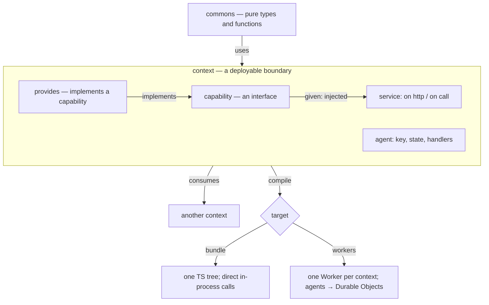
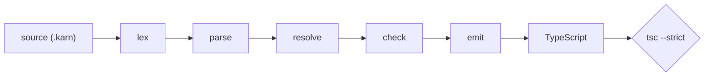

# How a Karn program is shaped

Karn is *architecture-first*: the large-scale structure of a program — its
modules, boundaries, state, and dependencies — is expressed in the language
itself, not left to folder conventions. This page is the mental model, end to
end.

*The architecture is written in the language — modules, boundaries, and
dependencies — then mapped onto a deployment target.*

Text equivalent: a `commons` of pure types and functions is brought into a
`context` with `uses`. A context holds services (`on http` / `on call`), agents
(`key`, `state`, handlers), capabilities (interfaces injected with `given`), and
providers (`provides`, which implement a capability). A context reaches another
context's services with `consumes`. Compiling targets either **bundle** (one
TypeScript tree, direct in-process calls) or **workers** (one Worker per context;
agents become Durable Objects; cross-context calls go over Service Bindings,
validated at the boundary).

## The two kinds of module

Every Karn declaration lives in one of two top-level units:

- **`commons`** — pure, stateless building blocks: types and functions. A
  `commons` compiles to plain TypeScript types and functions. It has no state,
  no effects, and no dependencies on contexts.
- **[`context`](../../reference/glossary.md#term-context)** — a deployable boundary.
  Contexts hold [services](../../reference/glossary.md#term-service),
  [agents](../../reference/glossary.md#term-agent),
  [capabilities](../../reference/glossary.md#term-capability), and handlers. A
  context is the unit Karn deploys: on the `workers` target, each context becomes
  its own Cloudflare Worker.

A useful way to think about it: `commons` is your domain vocabulary; `context` is
a running, deployable piece of your system.

## What lives in a context

- **Services** group request handlers. A handler is an `on call` (an internal
  entry point) or an `on http` (an HTTP endpoint).
- **Agents** own state, keyed by identity. See [The agent model](../agents-and-state/the-agent-model.md).
- **Capabilities** are dependencies a handler asks for with `given` — an
  interface the context needs but does not itself implement.
- **[Providers](../../reference/glossary.md#term-provider)** (`provides`) supply an
  implementation of a capability.

## How the pieces connect

Two relationships wire a program together:

- **`uses`** brings a `commons` into scope — how a context (or another commons)
  reaches shared types and functions.
- **`consumes`** declares a dependency on *another context's services*. The
  consumer calls them by qualified name (optionally through an `as` alias). This
  is the only way one context calls into another, so the dependency graph between
  contexts is always written down and checkable.

Capabilities and `consumes` together mean dependencies are explicit at two
levels: what a handler needs (capabilities, injected) and what a context depends
on (other contexts, consumed). Neither is implicit, so the architecture cannot
quietly acquire a dependency nobody declared.

## Effects thread through

Anything that touches state, a capability, or another context is *effectful*, and
its type says so: handlers return `Effect[T]`. Effectful results are sequenced
with `<-`. Pure code (a `commons` function) cannot perform effects, and the
compiler enforces the separation. The result is that the effectful parts of a
program are visible in the types, and the pure core stays pure.

> [!WARNING]
> A `commons` function is pure: it cannot perform effects or reach a capability.
> Effectful work belongs in a context's handlers and providers, where it shows in
> the type as `Effect[T]`.

## From source to deployment

Compilation is a fixed pipeline:

*The compile pipeline.* Source is lexed, parsed, name-resolved, and
type-checked, then emitted as TypeScript; a final `tsc --strict` pass verifies
the emitted code, so a successful build is type-correct end to end.

The source layout *is* the structure: a unit's file path must match its qualified
name, so the tree on disk mirrors the architecture. Compilation then maps that
structure onto the target:

- On **`bundle`**, everything becomes one TypeScript tree and contexts call each
  other directly.
- On **`workers`**, each context becomes a Worker, agents become Durable Objects,
  and cross-context calls go over Service Bindings with validation at the
  boundary.

See [Target Cloudflare Workers](../projects-build-and-deployment/cloudflare-workers.md) for the
target details, and [Why compile to TypeScript](../projects-build-and-deployment/why-compile-to-typescript.md) for
why the runtime is what it is.
