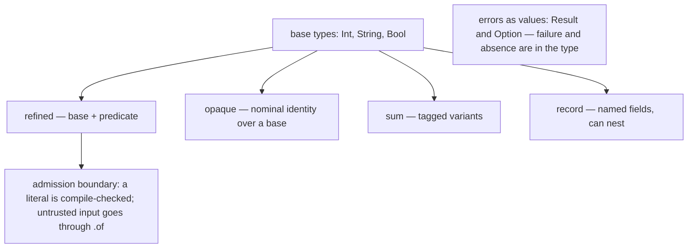

# The type-system philosophy

Karn's type system is built around one goal: **make illegal states
unrepresentable**. If a value cannot be expressed, no code — yours or anyone
else's — can produce it, and a whole class of bug simply cannot occur. Three
ideas do most of the work.

## Refinement: types describe values, not just shapes

A conventional type says "this is an integer". A
*[refined](../../reference/glossary.md#term-refined-type)* type says "this is an
integer between 0 and 150". The predicate is part of the type, so an out-of-range
`Age` is not a value you forgot to check — it is a value that cannot exist.

This has a sharp consequence at the boundary between trusted and untrusted data.
A literal you write is checked at compile time and admitted directly; input from
the outside world must pass through [`.of`](../../reference/glossary.md#term-of-unsafe),
which returns a [`Result`](../../reference/glossary.md#term-result-option). The type
system thereby forces validation to happen exactly once, at the edge, and
everything inside the edge can assume validity. See
[The refined-literal admission model](refined-literal-admission.md).

## Opacity: identity matters

Two values can have the same representation and yet mean entirely different
things. An order id and a customer id might both be strings, but swapping them is
a serious bug. An **[opaque](../../reference/glossary.md#term-opaque-type)** type
gives a value a distinct identity: `OrderId` is backed by a `String` but is not a
`String`, and the compiler refuses to mix them.

In TypeScript, two string-backed aliases are interchangeable, so the swap
compiles and ships:

```typescript
type OrderId = string;
type CustomerId = string;

function refund(id: CustomerId) { /* … */ }

const order: OrderId = "ord_42";
refund(order); // compiles — OrderId and CustomerId are both `string`
```

In Karn, the opaque types are distinct, so the same swap does not build:

```karn,fail
{{#include ../../../diagnostics/types_opaque_swap.karn}}
```

```text
{{#include ../../../diagnostics/types_opaque_swap.txt}}
```

Opacity also enforces *boundaries*. A type owned by a context can be constructed
and inspected only within that context; from outside, it is an opaque token. The
data-hiding you would normally enforce by convention becomes a checked property.

## Errors as values: no hidden control flow

Karn has no exceptions and no `null`. An operation that can fail returns a
`Result[T, E]`; a value that might be absent is an `Option[T]`. Because the
failure is *in the type*, the caller cannot ignore it — to get at the success
value they must acknowledge the error case, whether by `match` or by propagating
with `?`.

The payoff is that control flow is visible. There is no invisible path by which a
function might abruptly unwind; every way a call can end is written in its return
type.

In TypeScript, a function that can fail still hands back its success type, so the
failure rides along unnoticed:

```typescript
function parsePort(raw: string): number {
  return Number(raw); // NaN on bad input — but the type is still `number`
}

const port: number = parsePort("not-a-port");
const next: number = port + 1; // compiles; NaN sails through, unchecked
```

Karn has no special "must use the `Result`" rule — it does not need one. A
`Result[Int, String]` simply *is not* an `Int`, so you cannot bind it to one and
move on:

```karn,fail
{{#include ../../../diagnostics/types_unhandled_result.karn}}
```

```text
{{#include ../../../diagnostics/types_unhandled_result.txt}}
```

To get the `Int`, you must handle the error case — with `match` or `?`.

## The throughline

Refinement narrows *which values* exist; opacity controls *what a value means and
who can touch it*; errors-as-values makes *failure explicit*. Together they push
correctness from runtime checks and discipline into the type system, where the
compiler enforces it for free. That is the same bet [Karn makes
everywhere](../../about/why-karn-exists.md): the correct way should be the structurally
enforced way.

The enforcement is not silent, either. Each refusal above arrived with a
diagnostic naming the exact invariant — the swapped id, the unhandled `Result` —
so the type system reads less like a wall than a teacher. That the constraints
are [pedagogical by design](../../about/why-karn-exists.md#what-this-adds-up-to) is the bet
underneath this one.



*Every value's type says what it is and what is legal with it — and validation
lives at the admission boundary.*

Text equivalent: on top of the base types (`Int`, `String`, `Bool`), Karn builds
four kinds of type — **refined** (a base plus a predicate), **opaque** (a nominal
identity over a base), **sum** (tagged variants), and **record** (named fields,
which can nest) — and `Result`/`Option` make failure and absence part of the type
rather than hidden control flow. The **admission boundary** sits on refined types:
a literal is checked at compile time, while untrusted input must go through `.of`.
See [the refined-construction flow](refined-literal-admission.md).
