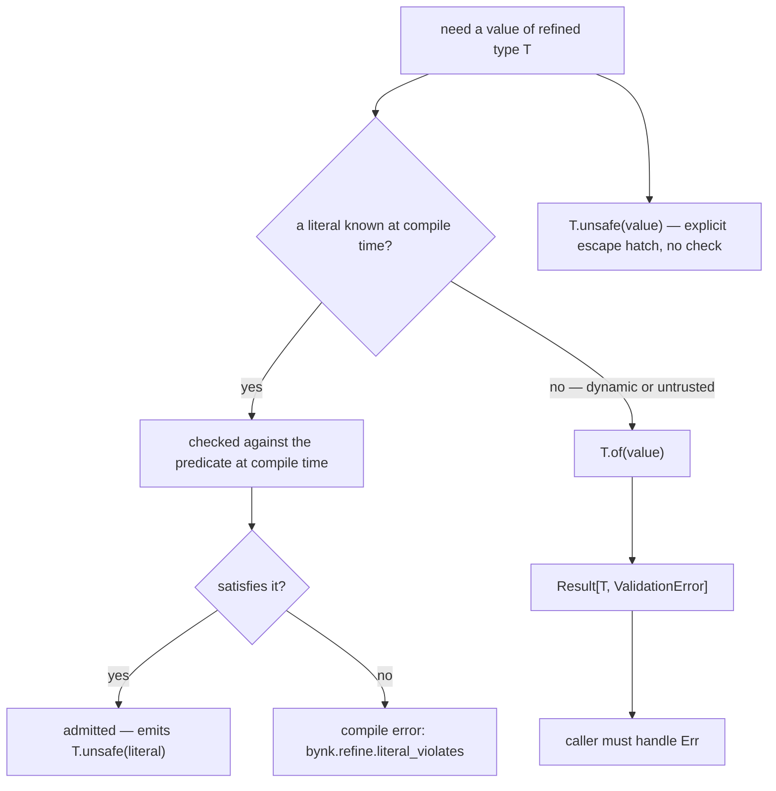

# The refined-literal admission model

When you write a literal where a
[refined type](../../reference/glossary.md#term-refined-type) is expected, Bynk
checks it at compile time and admits it directly — no
[`.of`](../../reference/glossary.md#term-of-unsafe), no
[`Result`](../../reference/glossary.md#term-result-option):

```bynk
fn defaultQty() -> Quantity {   -- Quantity = Int where InRange(1, 100)
  5
}
```

This page explains why admission works this way rather than the alternatives.

The flip side is what makes it worth having. In TypeScript, a refined value is
"just a number", so an impossible one compiles:

```typescript
const age: number = 240; // compiles — 240 is a perfectly good `number`
```

In Bynk, a literal in a refined-type position is checked against the predicate at
compile time, so the out-of-range value cannot be constructed:

```bynk,fail
{{#include ../../../diagnostics/refine_out_of_range.bynk}}
```

```text
{{#include ../../../diagnostics/refine_out_of_range.txt}}
```

## The tension

A refined type's constructor, `.of`, **always returns a `Result`**, because in
general a value's validity is not known until runtime. But a literal you write is
known at *compile* time. Forcing `Quantity.of(5)?` for a constant you can see is
valid would be noise — and worse, it would push a `Result` into places (a return
position, a constant) where there is genuinely nothing to handle.

So there is a real tension: `.of` must stay uniform (always a `Result`), yet a
known-good literal should be ergonomic.

## The options that were rejected

- **Overload `.of` to sometimes return `T` and sometimes `Result[T, …]`.** This
  breaks the single most useful property of `.of` — that it has one type and
  always returns a `Result`. Callers could no longer rely on it.
- **Add a separate `T.lit` (or similar) constructor for literals.** This adds a
  second spelling for "make one of these", which users must learn and choose
  between, for no semantic gain.

Both options trade away consistency for a little convenience.

## The model Bynk uses

Instead, admission is **expected-type-directed** and purely additive: in
positions where the expected type is a refined type, a literal is checked against
the predicate and admitted. Those positions are the return position, a `let` with
a type annotation, an `Ok`/`Some`/`Err` payload, and a refined-typed call
argument. A valid literal compiles (lowering to `.unsafe`); an invalid one is a
compile error, [`bynk.refine.literal_violates`](../../troubleshooting/refine-literal-violates.md).



*Literals are proven correct at compile time; values from the outside world go
through `.of` and a `Result`.*

Text equivalent: to get a value into a refined type `T`, a literal known at
compile time is checked against the predicate — if it satisfies it the literal is
admitted (emitting `T.unsafe(literal)`), otherwise it is a compile error
(`bynk.refine.literal_violates`). Dynamic or untrusted input goes through
`T.of(value)`, which returns `Result[T, ValidationError]` that the caller must
handle. `T.unsafe(value)` is the explicit escape hatch: it asserts validity with
no check.

Two properties make this the right trade:

- **Consistency is preserved.** `.of` is untouched — still one type, still always
  a `Result`. Admission is a separate, additive rule, not a change to the
  constructor.
- **It is non-breaking.** Adding admission only makes previously-invalid programs
  (a bare literal where `.of` was required) compile. No existing program changes
  meaning.

Opaque types are excluded from admission: their whole point is that values are
constructed only through designated paths, so an implicit literal would undermine
them.

## See also

- How-to: [Use a literal where a refined type is expected](use-a-literal.md).
- Reference: [refined-type API](../../reference/refined-types.md).
