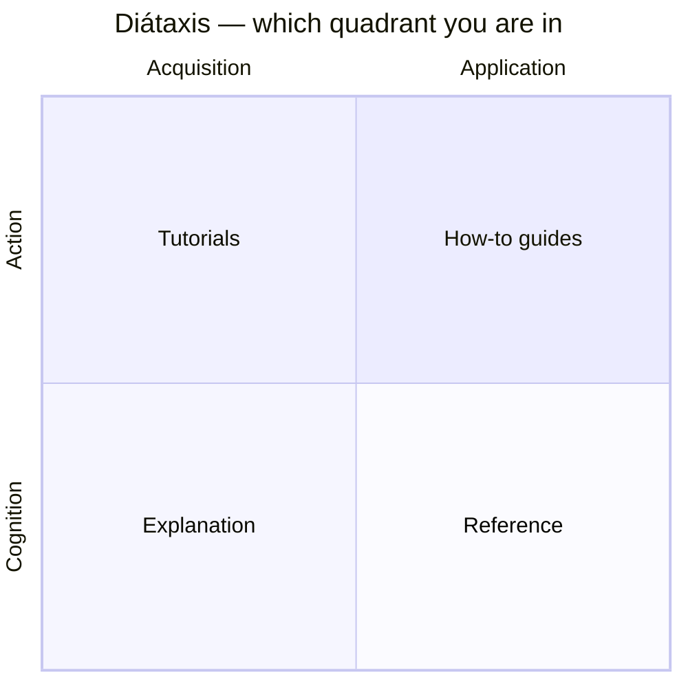

# How these docs are organised

This book is organised **by concern**. Each part of Bynk — the type system,
program structure, effects & capabilities, agents, entry points, testing,
projects, tooling — has one home that co-locates everything you need to learn it
and act on it. You shouldn't have to hop across the book to understand and use a
single topic.

Within a concern, the book still follows **[Diátaxis](https://diataxis.fr/)** —
the discipline of keeping the *kinds* of documentation apart, one per page, so a
page that teaches never argues rationale and a page you look something up in
never walks you through a task. Concern-first grouping makes that discipline
*more* load-bearing, not less: the modes now sit side by side, so each must stay
in its lane.

## The shape of the book

1. **Getting started** and **Learn Bynk** — the on-ramp: what Bynk is, how to
   install it, and a single guaranteed end-to-end tutorial spine
   ([Compile your first program](../tutorials/01-first-program.md) onward).
2. **[Guides](../guides/index.md)** — the main body, **one section per
   concern**, each co-locating its explanation and how-to pages with a short
   landing page that links out to the reference and spec.
3. **[Reference](../reference/index.md)** and
   **[Specification](../spec/index.md)** — the *lookup* surfaces, kept whole and
   uniform: dry, complete catalogues you scan to confirm an exact rule. They are
   not split by concern, because you read them by jumping to a known entry.
4. **About Bynk**, **Troubleshooting**, **Contributing**, and **Tooling** round
   out the background, the diagnostic catalogue, and the two further audiences
   (compiler contributors, and tool users who may not write Bynk).

The split is between **journey** and **lookup**. Tutorials, how-to guides, and
explanation are read *on a journey* — while learning, doing, or trying to
understand a concern — so they group by concern. Reference and the normative spec
are read *to look something up* — so they stay whole.

## The four kinds, one per page

| Kind | When you are… | It answers | What it looks like |
|---|---|---|---|
| **[Tutorial](../tutorials/01-first-program.md)** | learning | "Teach me." | A guided lesson. The author drives; guaranteed to work end to end. |
| **How-to** (in a [guide](../guides/index.md)) | doing a task | "How do I X?" | Steps to a goal you already have. Assumes the basics. |
| **Explanation** (in a [guide](../guides/index.md)) | trying to understand | "Why is it like this?" | Discussion, rationale, and trade-offs. |
| **[Reference](../reference/index.md)** | looking something up | "What is the exact behaviour of X?" | Dry, complete, accurate. Structured like the language. |

Two axes underlie the kinds. **Tutorials** and **how-to** are for *action*
(doing); **reference** and **explanation** are for *cognition* (thinking).
**Tutorials** and **explanation** serve *acquiring* skill and understanding;
**how-to** and **reference** serve *applying* what you already have.



*Which quadrant you are in — acquisition vs application, action vs cognition —
tells you what to expect.*

```text
                 ACQUISITION                 APPLICATION
            (learning / studying)       (working / applying)
          ┌───────────────────────┬───────────────────────┐
   ACTION │       Tutorials       │       How-to           │
 (doing)  │   "teach me"          │   "how do I X?"        │
          ├───────────────────────┼───────────────────────┤
COGNITION │     Explanation       │      Reference         │
(thinking)│   "why is it so?"     │   "what exactly is X?" │
          └───────────────────────┴───────────────────────┘
```

The kinds link *outward* to one another rather than repeating content: a how-to
points to the reference for exact rules and to an explanation for the reasoning;
a tutorial sends you to a guide when you want to know *why* a step works. So:
follow the **tutorial spine** when you are new, open a **guide** for a concern
you are working in, consult the **reference**/**spec** to confirm exact
behaviour, and read a guide's **explanation** for the reasoning behind a design.

## A note on code samples

Many reference and guide snippets show a declaration on its own — a bare `type`,
`fn`, or `service` — to keep the focus on the construct being explained. In a
real source file, every declaration lives under a module header: a `commons`
(pure, shareable code) or a `context` (a bounded context). The body braces are
**optional at file scope**, so a single-file program is most often written as a
header followed by its declarations:

```bynk
commons greetings

type Subject = String where NonEmpty
fn greeting(s: Subject) -> String { "Hello, \(s)!" }
```

[Tutorial 1](../tutorials/01-first-program.md) builds one from scratch; where a
snippet wraps its declarations in `commons name { … }`, that is the same module,
written with explicit braces.

## A note on status

Bynk is pre-1.0 and changes in small increments. The book documents **what
compiles today**; anything still on the roadmap is marked as planned rather than
described as if it exists. See
[Versioning & roadmap](../about/versioning-and-roadmap.md) for how the book
tracks the language.

An inline tag such as **(v0.20)** next to a feature means "introduced in that
version" — a pointer for readers tracking how the language grew, never a
requirement you need to act on. Everything documented here works in the current
version; the [changelog](../reference/changelog.md) has the per-version detail.
