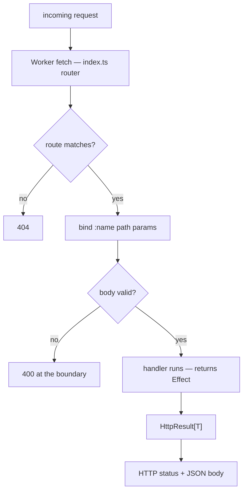

# HTTP

HTTP handlers are declared in a `service` inside a `context`. See the
[grammar for HTTP handlers](grammar.md#rule-http_handler) for the production
and the diagnostics that govern it.

## Handler form

```bynk
service <Name> from http {
  on <METHOD>("<route>") (<params>) -> Effect[HttpResult[T]] {
    …
  }
}
```

- **Methods:** `GET`, `POST`, `PUT`, `PATCH`, `DELETE`.
- **Route:** must start with `/`; a `:name` segment is a path parameter.
- **Parameters:** each parameter is either a path parameter (matching a `:name`
  segment) or the special `body` parameter. A path parameter's type must be
  constructible from a string (`bynk.http.path_param_not_stringy`); `GET` and
  `DELETE` may not take a `body` (`bynk.http.body_on_get_or_delete`).
- **Return type:** must be `Effect[HttpResult[T]]`
  (`bynk.http.return_not_effect_http_result`).

> [!DANGER]
> The `/_bynk/` route prefix is reserved for the runtime. Any route under it is
> rejected with `bynk.http.reserved_prefix`.

A `body` parameter is parsed from the request JSON and validated before the
handler runs; an invalid body is rejected with `400` at the boundary.

## `HttpResult` variants

The vocabulary tracks the common, modern HTTP status codes (RFC 9110). A
variant's payload is one of five shapes: the value `T` as JSON (`Value`), a
target URL emitted as a `Location` header (`Location`), an explanatory
`message` as an `{ "error": … }` JSON body (`Message`), a `Stream[String]`
emitted as an SSE (`text/event-stream`) body (`Streamed`), or no body at all
(`None`).

### 2xx success

| Variant | Status | Payload |
|---|---|---|
| `Ok(value)` | 200 | the value, as JSON |
| `Streaming(stream)` | 200 | a `Stream[String]`, SSE-framed (see [Streamed responses](#streamed-responses)) |
| `Created(value)` | 201 | the value, as JSON |
| `Accepted(value)` | 202 | the value, as JSON |
| `NoContent` | 204 | none |

### 3xx redirection

A redirect carries the target URL, emitted as a `Location` header with an empty
body.

| Variant | Status | Payload |
|---|---|---|
| `MovedPermanently(url)` | 301 | `Location` header |
| `Found(url)` | 302 | `Location` header |
| `SeeOther(url)` | 303 | `Location` header |
| `TemporaryRedirect(url)` | 307 | `Location` header |
| `PermanentRedirect(url)` | 308 | `Location` header |

### 4xx client error

| Variant | Status | Payload |
|---|---|---|
| `BadRequest(message)` | 400 | message |
| `Unauthorized` | 401 | none |
| `Forbidden` | 403 | none |
| `NotFound` | 404 | none |
| `MethodNotAllowed` | 405 | none |
| `NotAcceptable` | 406 | none |
| `RequestTimeout` | 408 | none |
| `Conflict(message)` | 409 | message |
| `Gone` | 410 | none |
| `LengthRequired` | 411 | none |
| `PayloadTooLarge(message)` | 413 | message |
| `UnsupportedMediaType(message)` | 415 | message |
| `UnprocessableEntity(message)` | 422 | message |
| `TooManyRequests(message)` | 429 | message |
| `UnavailableForLegalReasons(message)` | 451 | message |

### 5xx server error

| Variant | Status | Payload |
|---|---|---|
| `ServerError(message)` | 500 | message |
| `NotImplemented(message)` | 501 | message |
| `BadGateway(message)` | 502 | message |
| `ServiceUnavailable(message)` | 503 | message |
| `GatewayTimeout(message)` | 504 | message |

> [!TIP]
> When `Ok`/`Err` could mean either `Result` or `HttpResult`, qualify the
> constructor (e.g. `HttpResult.Ok(…)`) to resolve
> `bynk.types.ambiguous_constructor`.

## Streamed responses

`Streaming(stream)` returns a **200** whose body is a [`Stream[String]`](types.md#stream),
emitted as Server-Sent Events (`content-type: text/event-stream`). Each stream
element becomes one SSE event — `data: <element>\n\n` — so a handler can send an
incremental feed without buffering the whole response:

```bynk
on GET("/ticks") by v: Visitor () -> Effect[HttpResult[()]] {
  Streaming(Stream.of(["tick-1", "tick-2", "tick-3"]).take(3))
}
```

A streamed handler returns `Effect[HttpResult[()]]` — the JSON body parameter
`T` is unused, since the body is the stream. **A response commits its status and
headers before the first chunk**, so streaming is **200-only**: handle a
pre-stream failure by returning an ordinary variant *instead* of `Streaming`
(`NotFound`, `Unauthorized(…)`, …), which share `HttpResult[()]` and so sit in
the same handler with no type conflict:

```bynk
on GET("/feed/:mode") by v: Visitor (mode: String) -> Effect[HttpResult[()]] {
  if mode == "live" {
    Streaming(Stream.of(events).take(100))
  } else {
    NotFound
  }
}
```

A producer that can fail mid-stream carries its outcome in-band — build a
`Stream[Result[String, E]]` and `.map` it to `Stream[String]`, encoding an `Err`
as an error event — because the HTTP status is already sent once streaming
begins. A bounded `take` is the language-level guard against an unbounded
response. A structured event type (named `event`/`id`/`retry` fields) is a
planned follow-on; v1 streams plain `String` events.

## Request lifecycle



*Validation happens once, at the edge; the handler only ever sees valid input.*

Text equivalent: the Worker's `fetch` entry point (`index.ts`) routes the request;
an unmatched route is a `404`. On a match, path parameters are bound and any
`body` is parsed and validated against its refined type — an invalid body is
rejected with `400` at the boundary, before the handler runs. The handler then
runs as an `Effect` and returns an `HttpResult[T]`, which is mapped to an HTTP
status and JSON body per the table above.

## Example

```bynk
context notes

service api from http {
  on GET("/ping") by Visitor () -> Effect[HttpResult[String]] {
    Ok("pong")
  }

  on GET("/notes/:id") by Visitor (id: String) -> Effect[HttpResult[String]] {
    NotFound
  }
}
```

## Emission

`from http` services compile to a runnable Cloudflare Worker on the `--target
workers` target (`index.ts` router, `handlers.ts`, `compose.ts`,
`wrangler.toml`). See [emission](emission.md) and
[Target Cloudflare Workers](../guides/projects-build-and-deployment/cloudflare-workers.md).
