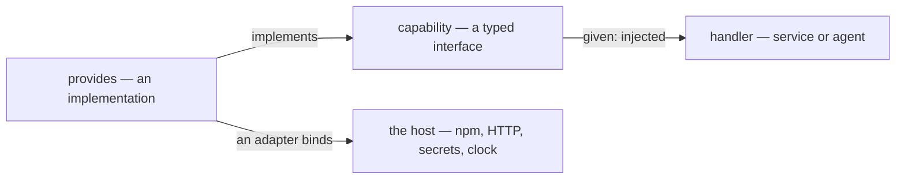

Most of Bynk is pure: types and functions that compute, with no way to reach the
outside world. But real programs *must* reach it — to log, to read a secret, to
call an HTTP API, to read the clock. Bynk does not let that happen invisibly.
Every effect on the outside world is **explicit in a type** and **gated by a
capability** the code must be granted. This page is the mental model behind the
*Do* recipes that follow; for the exact syntax and error categories, see the
[capabilities reference](/book/reference/capabilities/).



## Why effects are gated

In ordinary TypeScript any function can call `fetch`, read `process.env`, or
write to a database — nothing in its signature says so. That invisibility is what
makes code hard to test and to reason about: you cannot tell what a function
*touches* without reading its whole body and everything it calls.

Bynk makes the reach explicit. Effectful work has the type **`Effect[T]`** — a
description of an outside-world interaction that yields a `T` — and a function
can only perform an effect by being *handed* the capability that does it. So a
signature tells you the truth: a handler that needs to log says so, and one that
claims to be pure cannot secretly call the network.

## Capability: a typed interface to the outside world

A **capability** is a contract — a named set of operation *signatures*, with no
bodies:

```bynk,ignore
capability Logger {
  fn info(message: String) -> Effect[()]
}
```

It says *what* can be done (`info` takes a `String`, performs an effect, yields
nothing) without saying *how*. Each operation returns `Effect[T]` because calling
it is exactly how effectful work reaches the outside.

## `given`: declaring what you need

A handler — a service operation, an agent handler, or another provider — lists
the capabilities it needs in a **`given`** clause, and may then call them:

```bynk,ignore
on call() -> Effect[String] given Logger {
  let _ <- Logger.info("hi")
  "ok"
}
```

`given` is the gate. You may only call a capability you have declared, and a
capability you declare but never use is flagged — so the `given` line stays an
honest summary of what the handler touches. The `let x <- expr` form *runs* an
effect and binds its result; here the result is `()`, so it is discarded.

## `provides`: an implementation

A **provider** implements a capability — every operation, signatures matching
exactly:

```bynk,ignore
provides Logger = ConsoleLogger {
  fn info(message: String) -> Effect[()] {
    Effect.pure(())
  }
}
```

`Effect.pure(value)` is the **trivial effect**: "do nothing on the outside world,
just yield this value." It is how an operation body produces an `Effect[T]`
without performing any real I/O — here `Effect.pure(())` yields the empty value
`()`, a placeholder body for a logger that, in this example, does nothing.

Put together, the three pieces form one self-contained context — a capability, an
implementation, and a handler granted it:

```bynk
context greeting

capability Logger {
  fn info(message: String) -> Effect[()]
}

provides Logger = ConsoleLogger {
  fn info(message: String) -> Effect[()] {
    Effect.pure(())
  }
}

service hello {
  on call() -> Effect[String] given Logger {
    let _ <- Logger.info("hi")
    "ok"
  }
}
```

A provider may itself need capabilities — it carries its own `given`, and the
providers then form a **dependency graph** that Bynk wires up in order (the
*composition root*). [Compose a provider](/book/guides/effects-and-capabilities/compose-a-provider/) builds one;
[Share a capability across contexts](/book/guides/effects-and-capabilities/share-across-contexts/) exports one for
other contexts to consume.

## Adapters: the seam to the host

A capability is just a contract — something has to *actually* talk to the host.
That is an **adapter**: it declares a capability and binds it to a TypeScript
implementation (an npm library, a remote API), so the rest of your code consumes
a real integration as an ordinary capability, with the messy boundary sealed
behind the contract. [Wrap a library as an adapter](/book/guides/effects-and-capabilities/wrap-a-library/) walks
through one; the [adapters reference](/book/reference/adapters/) is the full
surface.

Bynk ships first-party capabilities this way under the **`bynk`** namespace — for
example `bynk.Secrets` (configuration and secrets) and `bynk.Fetch` (outbound
HTTP) — consumed with `consumes bynk { … }` and granted with `given`, exactly
like any capability you declare yourself. The
[first-party `bynk` capabilities](/book/reference/bynk-capabilities/) reference
catalogues the full set.

## The shape to take away

- **Effects are typed** (`Effect[T]`) and **gated** — code reaches the outside
  world only through capabilities it is granted.
- A **capability** is the contract; a **provider** is an implementation; an
  **adapter** is a provider that binds to the host.
- **`given`** declares what a handler or provider needs; you can call only what
  you declared.

With that model in hand, the recipes below are mechanical.

**See also:** [Capabilities & providers reference](/book/reference/capabilities/),
[Adapters reference](/book/reference/adapters/),
[How a Bynk program is shaped](/book/guides/program-structure/how-a-program-is-shaped/).
