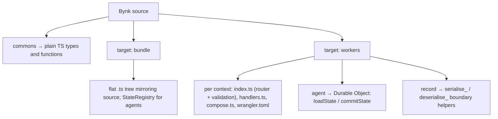

Bynk compiles to TypeScript. This page summarises what each construct emits. The
output is deterministic and headed `// Generated by bynkc — do not edit by hand.`

## Targets

| Target | Flag | Layout | Cross-context calls |
|---|---|---|---|
| Bundle | `--target bundle` (default) | flat `.ts` tree mirroring source | direct in-process calls |
| Workers | `--target workers` | one Worker dir per context | JSON over Service Bindings, validated at the boundary |

See [Target Cloudflare Workers](/book/guides/projects-build-and-deployment/cloudflare-workers/).



*One construct, deterministic output — and what that output is depends on the
target.*

Text equivalent: a `commons` emits plain TypeScript types and functions on either
target. On **bundle**, the output is a flat `.ts` tree mirroring the source, with a
`StateRegistry` backing agents. On **workers**, each context emits `index.ts`
(router and boundary validation), `handlers.ts` (logic), `compose.ts` (wiring), and
`wrangler.toml`; each agent emits a Durable Object class with `loadState` /
`commitState`; and records gain `serialise_*` / `deserialise_*` helpers for the
boundary.

## Types

| Bynk | TypeScript |
|---|---|
| `type Id = Int` (alias) | branded `number` + `Id.of`/`Id.unsafe` |
| refined type | branded base + `.of` (runtime predicate check) + `.unsafe` |
| opaque type | branded base + constructors; no structural access |
| record | `interface` with `readonly` fields; object literal construction |
| sum | discriminated union on `tag` + a constructor namespace |

```bynk
type Status = | Pending | Shipped(tracking: String)
```

```typescript
export type Status =
    { readonly tag: "Pending" }
  | { readonly tag: "Shipped"; readonly tracking: string };

export const Status = {
  Pending: { tag: "Pending" } as Status,
  Shipped: (tracking: string): Status => ({ tag: "Shipped", tracking }),
};
```

## Expressions

| Bynk | TypeScript |
|---|---|
| `if … else …` | conditional expression / `if` |
| `match` | `switch` on `.tag`, payloads bound as `const` |
| admitted literal | `T.unsafe(literal)` |
| `?` | early-return on `Err` |
| `<-` | `await` |

## Agents

A state `interface`, a zero-value factory, and a class with `loadState` /
`commitState`. On `bundle`, a `StateRegistry`; on `workers`, a Durable Object.

```typescript
function __zeroOfCounterState(): CounterState { return { count: 0 }; }
// loadState(): return stored ?? __zeroOfCounterState();
```

## HTTP (workers target)

Each context with HTTP handlers emits `handlers.ts` (logic),
`index.ts` (router + boundary validation), `compose.ts` (wiring), and
`wrangler.toml`. Records gain `serialise_*` / `deserialise_*` helpers for the
boundary.

## Tests

A per-target test module plus an aggregating `tests/main.ts` runner; `bynkc test`
compiles, type-checks with `tsc`, and runs it with Node.
