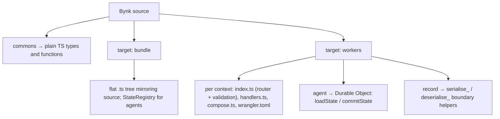

Bynk compiles to TypeScript. This page is the practical companion to the
[emission spec](/book/spec/emission/): where the spec states the *normative* rules
by which each construct is translated, this page walks an integrator through *what
lands on disk* and how to read, debug, or wire into it. The output is
deterministic and every emitted file is headed
`// Generated by bynkc — do not edit by hand.`

Wherever an exact rule matters — a lowering, a validator shape, a runtime
signature — this page links to the spec rather than restating it, so the two never
drift. In particular, [§7 "Meaning by translation"](/book/spec/emission/) governs
per-construct lowering and [§7.4 the runtime-library contract](/book/spec/runtime-library/)
governs the shared helpers.

## Targets

`bynkc` emits one of two build targets, selected by `--target`.

| Target | Flag | Layout | Cross-context calls |
|---|---|---|---|
| Bundle | `--target bundle` (default) | flat `.ts` tree mirroring source | direct in-process calls; agents backed by an in-memory `StateRegistry` |
| Workers | `--target workers` | one Cloudflare Worker directory per context | validated JSON over a Service Binding; agents are Durable Objects |

The same source compiles cleanly under either target: the difference is entirely in
*how contexts reach one another* and *where agent state lives*. **Bundle** is the
fast inner loop — everything runs in one process, cross-context calls are ordinary
function calls, and there is no serialisation on the hot path. **Workers** is the
deployment target — each context is isolated, calls cross an HTTP boundary that
validates its payload, and agents become durable, individually-addressable objects.
See [Target Cloudflare Workers](/book/guides/projects-build-and-deployment/cloudflare-workers/)
for the deployment guide, and [§7.2](/book/spec/emission/) for the normative target
definitions.



*One construct, deterministic output — and what that output is depends on the
target.*

Text equivalent: a `commons` emits plain TypeScript types and functions on either
target. On **bundle**, the output is a flat `.ts` tree mirroring the source, with a
`StateRegistry` backing agents. On **workers**, each context emits `index.ts`
(router and boundary validation), `handlers.ts` (logic), `compose.ts` (wiring), and
`wrangler.toml`; each agent emits a Durable Object class with `loadState` /
`commitState`; and records crossing a boundary gain `serialise_*` / `deserialise_*`
helpers.

## Project shape on disk

Every project emits a shared `out/runtime.ts` — the runtime library — and every
other emitted file imports from `./runtime.js`. The runtime carries the pieces that
are identical across a whole project: `Result` / `Option` / `HttpResult`, the agent
state surface (`StateRegistry`, `makeAgent`, `invariantViolation`), the cross-Worker
boundary (`callService`, `BoundaryError`), the actor verifiers, and the streams /
connection helpers. Its contract is normative — see
[§7.4](/book/spec/runtime-library/) — so integrating code should import from it
rather than reconstruct it.

Alongside every emitted `.ts` module, `bynkc` writes two sidecars:

- **`<file>.ts.map`** — a standard source map, with a `//# sourceMappingURL`
  trailer appended to the module. This is what maps a stack frame in the generated
  TypeScript back to the Bynk line that produced it.
- **`<file>.bynkdbg.json`** — a debug-metadata sidecar recording how emitted
  handler symbols correspond to the Bynk constructs that declared them, so a
  debugger can name stack frames in Bynk terms. It is a sibling like the source
  map; it is never bundled into the shipped Worker.

An emitted `tsconfig.json` pins `target: ES2022`, `module: NodeNext`, and `strict`,
so the output type-checks under the same settings `bynkc` assumes.

## Types

Nominal type constructs lower to a *branded* base type plus a constructor surface.
Branding gives Bynk's nominal guarantees inside TypeScript's structural system; the
constructors are where the runtime checks live. The exact branding and constructor
rules are in [§7.3](/book/spec/emission/).

| Bynk | TypeScript |
|---|---|
| `type Id = Int` (alias) | branded `number` + `Id.of` / `Id.unsafe` |
| refined type | branded base + `.of` (runs the refinement predicate, returns `Result`) + `.unsafe` |
| opaque type | branded base + constructors; representation is not structurally accessible |
| record | `interface` with `readonly` fields; object-literal construction |
| sum | discriminated union on `tag` + a constructor namespace |

Two constructors are emitted for each aliased, refined, or opaque type:

- **`.of(value)`** returns a `Result` — it runs any refinement predicate and yields
  `Err` on failure. This is the checked path; prefer it at the edges.
- **`.unsafe(value)`** brands without checking. The compiler emits `.unsafe` only
  where a value is statically known to satisfy the type (e.g. an *admitted*
  literal), so integrating code should reach for `.of`.

An opaque type additionally hides its representation: the generated base type is not
exported structurally, so callers cannot read or reconstruct the underlying value.

For a sum, `match` becomes a `switch` (see below), and construction goes through the
emitted namespace:

```bynk
type Status = | Pending | Shipped(tracking: String)
```

```ts
export type Status =
    { readonly tag: "Pending" }
  | { readonly tag: "Shipped"; readonly tracking: string };

export const Status = {
  Pending: { tag: "Pending" } as Status,
  Shipped: (tracking: string): Status => ({ tag: "Shipped", tracking }),
};
```

## Expressions

Expression lowering is mostly what you would write by hand; the interesting cases
are the ones that carry control flow or effects. Exact semantics are in
[§7.3](/book/spec/emission/).

| Bynk | TypeScript |
|---|---|
| `if … else …` | conditional expression / `if` |
| `match` | `switch` on `.tag`, payloads bound as `const` |
| admitted literal | `T.unsafe(literal)` |
| `?` (try) | early-return on `Err` |
| `<-` (bind) | `await` |
| `~>` (async send) | `ctx.__exec.waitUntil(…)` on workers; in-process on bundle |

Two of these are worth reading closely when debugging generated code:

- **`?`** unwraps a `Result`: on `Ok` it continues with the inner value; on `Err`
  it returns that `Err` from the enclosing function immediately. In a stack trace,
  an early return from the middle of a handler is almost always a `?`.
- **`~>`** is fire-and-forget. On the **workers** target it is registered with
  `ctx.__exec.waitUntil(…)` so the runtime keeps the invocation alive until the
  send completes, even after the response has been returned. On **bundle** it runs
  in-process. Either way the caller does not await the result.

A `match` arm binds its payload as `const` before the arm body, so a debugger sees
named locals rather than repeated `.tag` access:

```bynk,ignore
match status {
  Pending => "waiting"
  Shipped(tracking) => "sent: " ++ tracking
}
```

## Agents

An agent lowers to three things: a state `interface`, a zero-value factory, and a
class exposing `loadState` / `commitState`. `makeAgent` selects the backing store —
in-memory `StateRegistry` on bundle, Durable Object on workers — by whether a
Durable Object binding is present, so the same handler code drives both targets.

```ts
function __zeroOfCounterState(): CounterState { return { count: 0 }; }
// loadState(): return stored ?? __zeroOfCounterState();
```

The load/commit cycle is where an agent's guarantees are enforced, and it is the
part integrators most need to understand:

- **`loadState()`** returns the persisted state, or the zero value if none exists.
  On workers, rehydrating persisted state re-validates it against the current type
  definitions; if a refined field, key, or entry no longer satisfies its type (for
  instance a refinement tightened across a deploy, orphaning previously-valid data)
  it raises a `rehydrationViolation(agent, detail)`. This is an internal fault, not
  a caller-facing `BoundaryError`: the supplier is trusted past-self, so the failure
  is logged with the agent type and field path only — never the key or the offending
  value.
- **`commitState(state)`** checks every invariant predicate *before* writing. If an
  invariant fails, it throws `invariantViolation(agent, name)` and does **not**
  persist the offending state — so a rejected write leaves the stored state exactly
  as it was. On workers this is the Durable Object's storage; on bundle it is the
  registry entry.

See [§7.3 agents](/book/spec/emission/) for the lowering and
[§7.4](/book/spec/runtime-library/) for the `StateRegistry` / `makeAgent` /
`invariantViolation` contract.

## Services and the Worker entry (workers target)

A context with services emits four files plus its Worker config:

| File | Role |
|---|---|
| `handlers.ts` | the handler logic — the code you wrote, lowered |
| `index.ts` | the Worker entry: router + boundary validation |
| `compose.ts` | wiring — how handlers, agents, and bindings are assembled |
| `wrangler.toml` | the Cloudflare Worker configuration |

`commons` (types and functions) lowers to plain TypeScript and is identical on both
targets; only services, agents, and the boundary differ.

### The `fetch` entry

Each context's `index.ts` exports the Cloudflare Worker shape:

```ts
export default {
  async fetch(request: Request, env: Env, ctx: ExecutionContext): Promise<Response> {
    // dispatch …
  },
};
```

`fetch` dispatches, in order, over:

- **HTTP routes** — matched by method and path. Routes are ordered by literal
  specificity, so a literal segment wins over a parameter at the same position; this
  makes routing deterministic regardless of declaration order.
- **Cron schedules** — handlers declared `on cron`.
- **Queue consumers** — handlers declared `on queue`.
- **WebSocket upgrades** — upgrade requests are accepted and handed to the
  connection machinery.
- **Internal Service-Binding calls** — requests under the `/_bynk/call/<servicePath>`
  prefix, which is how one Worker reaches another (see below).

The router, the boundary validation it performs, and the response encoding
(`httpResultToResponse`) are specified in [§7.3 HTTP services](/book/spec/emission/).

### `wrangler.toml`

One `wrangler.toml` is generated per Worker, pinned to a compile-time
`compatibility_date` (currently `2024-11-01`). Its contents are derived from the
context's closure, so the config always matches what the code actually reaches:

- **`name`** and **`main = "index.ts"`** — the Worker identity and entry.
- **`[[services]]`** — one Service Binding per consumed context. The binding name is
  the consumed context uppercased with dots replaced by underscores
  (`commerce.payment` → `COMMERCE_PAYMENT`).
- **`[[kv_namespaces]]`** — emitted only if the closure reaches the `bynk.cloudflare`
  KV adapter. The `id` is a deploy-time placeholder.
- **`[[durable_objects.bindings]]`** and **`[[migrations]]`** — one binding per agent
  (binding name is the class in screaming-snake-case, e.g. `OrderEntity` →
  `ORDER_ENTITY`), plus a migration registering the new Durable Object classes.
- **`[triggers] crons`** — every `on cron` schedule in the context, aggregated.
- **`[[queues.consumers]]`** — one consumer per `on queue` service.

Because the config is generated from the closure, an integrator can read
`wrangler.toml` as a manifest of everything the Worker touches — every downstream
service, every agent, every trigger.

## The cross-Worker boundary

On the workers target, a call from one context to another goes as JSON over a
Service Binding to the callee's `/_bynk/call/<servicePath>` endpoint. The runtime
helper `callService` performs the call; the callee's `index.ts` validates the
payload before it reaches any handler. The full protocol is normative in
[§7.4](/book/spec/runtime-library/).

### Serialisation validators

Any record that crosses a boundary gets generated `serialise_<Type>` /
`deserialise_<Type>` helpers. `deserialise_*` returns a `Result<T, BoundaryError>`
and validates structurally *and* by refinement — so a payload that is shaped
correctly but violates a refined field is rejected, not silently admitted. The
generated `Result`, `Option`, `List`, and `Map` deserialisers compose the same way,
threading a `path` (e.g. `$.items[2].id`) so a failure points at the exact field.

`BoundaryError` has four kinds, and reading them tells you where a failed call went
wrong:

| Kind | Meaning |
|---|---|
| `MalformedJson` | the body was not valid JSON |
| `StructuralMismatch` | a field was missing or the wrong shape (carries `path`, `expected`, `actual`) |
| `RefinementViolation` | the shape was right but a refinement predicate failed (carries `path` and the `ValidationError`) |
| `Transport` | the call itself failed (carries an HTTP `status`) |

### Caller identity

`callService` stamps the calling context's qualified name into an `X-Bynk-Caller`
header. The callee threads this into a handler's `by c: Caller` binding so it can
present a live `CallerId`. This is *identity, not authentication*: the `Internal`
channel trusts the Service Binding, so the header records who called, and is not a
credential the callee verifies cryptographically.

## Actor authentication

Where a service is reached over an authenticated channel — a public HTTP edge rather
than a trusted internal binding — the actor scheme's verifier runs *at the boundary*,
before any handler. Two runtime verifiers are emitted on demand:

- **`verifyBearerJwtHs256`** — verifies a bearer JWT (HS256), enforcing `exp` /
  `nbf`. Used for authenticated end-user actors; the verified claims become the
  handler's actor identity.
- **`verifySignatureHmacSha256`** — a constant-time HMAC-SHA256 signature check,
  used for signed webhooks, with timestamp tolerance to bound replay.

Only the schemes a context actually uses pull their verifier into the emitted
imports; a zero-crypto prelude scheme mints no runtime export at all, so an
integrator auditing which crypto a Worker performs can read it off the runtime
imports. The verifier contracts are in [§7.4](/book/spec/runtime-library/).

## HTTP results

Handlers return an `HttpResult<T>`, and the runtime's `httpResultToResponse` encodes
it into a `Response` — so status codes and bodies are produced uniformly rather than
hand-assembled per handler. The `HttpResult` surface and its encoding are part of
the runtime contract; see [§7.4](/book/spec/runtime-library/).

## Streams and WebSockets (workers target)

A WebSocket handler lowers to an upgrade path in `fetch` plus a `Connection<F>`
abstraction backed by Cloudflare's hibernatable WebSockets. On bundle the same
handler runs against a `TestConnection<F>`, so streaming logic is exercisable without
a Worker. The connection helpers (`acceptHibernatableConnection`, `resolveConnection`,
`newWebSocketPair`) are part of the runtime library — see
[§7.4](/book/spec/runtime-library/) — and the lowering is in
[§7.3 streams/WebSockets](/book/spec/emission/).

## Tests

Tests emit a per-target test module plus an aggregating `tests/main.ts` runner.
`bynkc test` compiles the project, type-checks it with `tsc`, and runs the aggregated
suite with Node — so a test failure is either a Bynk assertion or a type error in the
emitted output, both surfaced against the same source-mapped frames as production
code.
